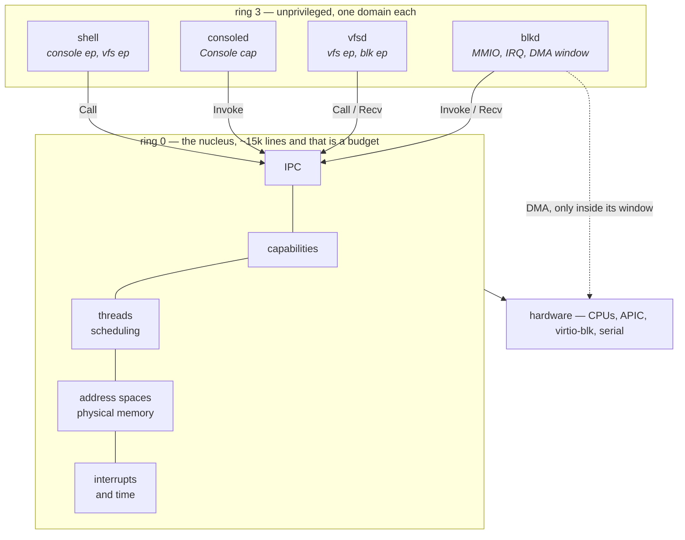
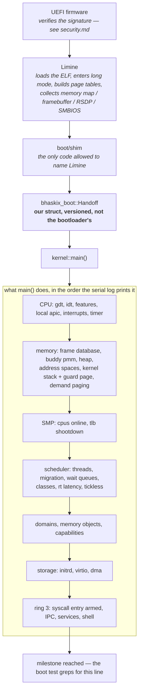
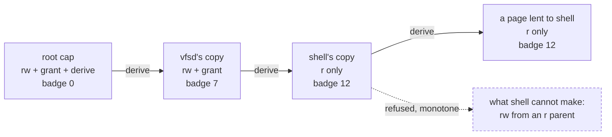
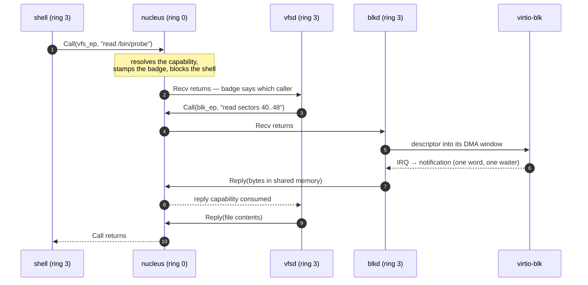
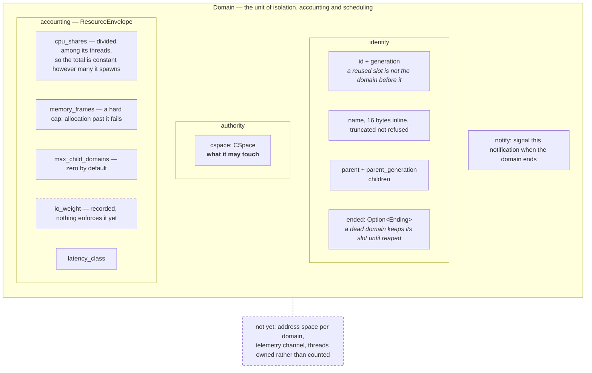
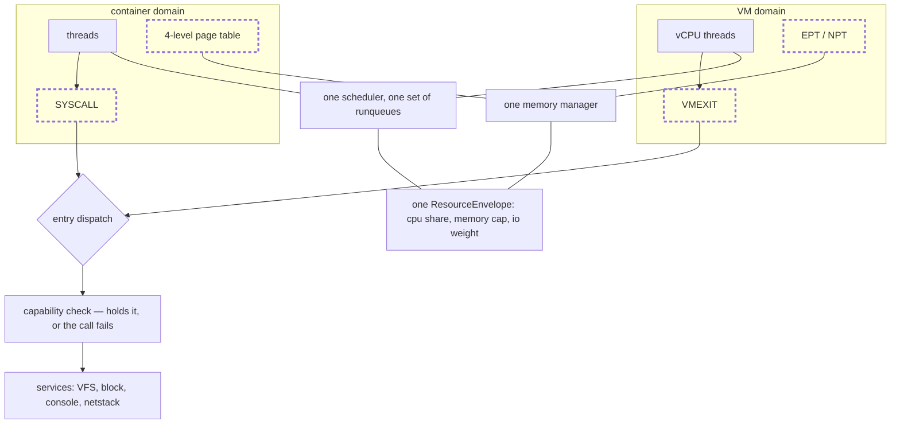

# Bhaskix — System Architecture

*Status: draft for review. This is the document every other design document derives from.*

- **Language:** Rust (`#![no_std]`) with minimal assembly. See [coding-style.md](coding-style.md).
- **Initial target:** `x86_64`. AArch64 is a Phase 3 concern, but the arch boundary is defined now.
- **Boot:** Limine protocol on UEFI (and BIOS, free of charge). See [Boot](#1-boot-architecture).

---

## 0. The one-paragraph summary

Bhaskix is a **capability-based nucleus with relocatable services**. A small privileged core owns
physical memory, address spaces, threads, IPC, interrupt routing, and the capability system.
Everything else — VFS, network stack, device drivers, container and VM management — is a *service*
written against a message-passing interface. Services start life compiled into the nucleus for speed
and bootstrap simplicity, and can be moved into isolated userspace domains without rewriting them.
Containers and virtual machines are not separate subsystems; both are *domains*, differing only in
whether their instruction stream traps to a syscall or to a VMEXIT.

### The same paragraph, as a picture

Every diagram in these documents is text — Mermaid where a graph carries the meaning, ASCII where a
layout does. Not a stylistic preference: a diagram that is text diffs in a pull request, greps
alongside the code, and fails review when it stops matching the prose beside it. A checked-in PNG
rots silently, and the first person to notice is the one it misled.



The picture makes two claims, and both are checkable in the tree rather than taken on trust:

- **Nothing crosses the ring boundary except a capability invocation.** There is no numbered syscall
  table, because a call naming *what to do* without naming *what to do it to* is ambient authority
  and discards the thesis on the first syscall (§3).
- **Each ring 3 box lists everything it can reach.** `consoled` holds a `Console` capability, so a
  console service talked into misbehaving can put characters and take bytes. That is its authority
  in full, not an abbreviation of it.

The dashed arrow is the honest one. A driver's DMA reaches memory without asking the nucleus, so on
a machine with no IOMMU it reaches *all* of it — [memory.md](memory.md) §5 states the consequence
rather than the intent, and the boot log prints `NO IOMMU` on such a machine instead of staying
quiet about it.

---

## 1. Boot architecture



Every stage above prints a line and, where it can, a *measurement* rather than an assertion: how
many frames the reserve holds, how many ticks three idle CPUs took, which placement each service
got. A stage that only ever prints `ok` is a stage that cannot fail informatively, and this kernel
has been bitten by exactly that — see the M9-25 entry in `TRACKER.md`, where a line printed
unconditionally let a boot gate pass while the check under it failed.

Two stall points are known and recorded as open defects in `TRACKER.md` §3: one after `syscall entry
armed`, one earlier at `demand paging`. The second is out of reach of the bring-up watchdog, because
a watchdog that is a thread cannot report a stall that happens before the scheduler starts.

### The handoff boundary

The kernel **never** reads a Limine request struct directly. `boot/` contains a thin shim whose only
job is to translate whatever the bootloader gave us into `bhaskix_boot::Handoff`, a struct we own and
version:

```rust
#[repr(C)]
pub struct Handoff {
    pub version: u32,
    pub memory_map: &'static [MemoryRegion],
    pub hhdm_base: VirtAddr,          // direct map of all physical memory
    pub kernel_phys_base: PhysAddr,
    pub kernel_virt_base: VirtAddr,
    pub framebuffer: Option<Framebuffer>,
    pub rsdp: Option<PhysAddr>,       // ACPI
    pub smbios: Option<PhysAddr>,
    pub boot_cmdline: &'static str,
    pub initrd: Option<PhysSlice>,
    pub tpm_event_log: Option<PhysSlice>,
}
```

This is deliberate. It costs roughly 200 lines and buys three things:

1. We can replace Limine with our own UEFI loader (`bhaskixboot.efi`, a Phase 2 milestone) by
   rewriting only the shim.
2. We can add a BIOS, coreboot, or U-Boot path later without touching the kernel.
3. The kernel is testable on the host: construct a synthetic `Handoff` and run `mm` unit tests
   without any firmware at all.

**Invariant:** nothing in `kernel/`, `mm/`, `sched/`, `fs/`, `drivers/`, or `net/` may name Limine.
CI enforces this with a grep.

### Address space layout (x86_64, 4-level paging)

| Range | Contents |
|---|---|
| `0x0000_0000_0000_1000` – `0x0000_7FFF_FFFF_FFFF` | User space (per-domain) |
| *(canonical hole)* | |
| `0xFFFF_8000_0000_0000` + | HHDM — direct map of all physical RAM |
| `0xFFFF_9000_0000_0000` + | Kernel heap (slab / vmalloc region) |
| `0xFFFF_A000_0000_0000` + | Per-CPU areas, kernel stacks (guard-paged) |
| `0xFFFF_FFFF_8000_0000` + | Kernel image (text/rodata/data/bss) |

KASLR shifts the kernel image base and the heap base at boot. LA57 (5-level) support is detected and
the layout is parameterised, but 4-level is the tested path. Details: [memory.md](memory.md).

---

## 2. The nucleus

The nucleus is the code that runs with full hardware privilege. Its size is a **budget**, not an
accident. Target: under 15,000 lines of Rust excluding architecture-specific code and comments,
tracked in CI and reported on every PR.

The nucleus owns exactly seven things:

| Subsystem | Responsibility | Explicitly *not* its job |
|---|---|---|
| **Physical memory** | Frame allocation, ownership, zeroing | Deciding what memory is *for* |
| **Address spaces** | Page tables, mapping, COW, demand paging | File-backed mapping semantics (that's VFS) |
| **Threads** | Contexts, kernel stacks, FPU state | Process/session/job concepts |
| **Scheduling** | Deciding which thread runs next on which CPU | Policy tuning heuristics (pluggable) |
| **IPC** | Synchronous call/reply + async channels | Message *content* or protocol |
| **Capabilities** | Unforgeable handles, derivation, revocation | Who *should* get what (that's policy) |
| **Interrupts & time** | IDT/APIC routing, timers, IRQ→wakeup | Device semantics (that's a driver) |

Anything that does not appear in that table does not belong in the nucleus. When someone proposes
adding to it, the burden of proof is on the proposal.

### Why not a pure microkernel, and why not a monolith

A pure microkernel (seL4-style) is the honest expression of "security by design", but it makes early
progress slow, pushes hard performance problems to the front of the schedule, and historically
starves such projects before they get useful. A monolith gets to a working system fastest and throws
the security thesis away.

We take a third path and are explicit about its risk.

### Relocatable services — the design, and its honest caveat

A **service** is a Rust crate that implements `Service` and communicates only by messages. The build
selects a placement per service:

```
[services]
vfs      = "nucleus"     # trusted, in-kernel, direct call — fast path
netstack = "nucleus"
nvme     = "nucleus"
gpu      = "domain"      # isolated userspace domain, IPC + IOMMU
```

For this to work, a service must obey four rules, enforced by the crate's lint configuration:

1. No global mutable state. All state hangs off the service's own context object.
2. No direct hardware access. MMIO, DMA, and IRQs arrive only through capability handles.
3. No blocking calls. Services are `async` state machines driven by an executor the placement
   provides.
4. No panics on input. Malformed messages return errors; they do not unwind.

A note that arrives with [RFC 0009](rfc/0009-shared-memory.md): today's services move bytes in
message registers, which is placement-independent *by accident* — there is nothing to map either
way. Once a bulk path uses shared memory, the two placements genuinely differ in what they map, and
the both-placements CI job below stops being a formality.

**The caveat, stated plainly:** "write once, place anywhere" is a claim many systems have made and
few have delivered. The usual failure is that in-nucleus services quietly acquire direct calls,
shared statics, and pointer-passing, and the userspace placement rots.

**None of this is built yet, and this paragraph used to say otherwise.** It described two
mitigations — CI building both placements for every service, and a QEMU boot with all services
forced to `domain` — in the present tense, when there is no `Service` trait, no placement
selection, and no service that has ever run outside the nucleus. A design document that describes
its own safeguards as existing is the same failure as a warning that prints unconditionally: it
cannot tell the safe case from the dangerous one.

Both mitigations are specified by [RFC 0013](rfc/0013-service-framework.md), accepted, and land
with its steps 2 and 4. Until then this section describes an intention. If we ever cannot afford to
keep both placements green, we will say so here rather than quietly dropping the goal — and the
tense will be correct either way.

---

## 3. Capabilities

There is no user ID in the nucleus. There is no `root`. Authority is a *thing you hold*, not a *thing
you are*.

Every kernel object — a frame, an address space, a thread, an IPC endpoint, a notification, an IRQ
line, an MMIO range, a DMA window — is named by a **capability**: an unforgeable handle stored in a
per-domain capability space (CSpace). A domain can perform an operation if and only if it holds a
capability granting it.

A **notification** ([RFC 0010](rfc/0010-notifications.md), accepted) is the one that is easy to
overlook and hard to do without: one word of pending bits and at most one waiter, signalled without
blocking and safely from an interrupt handler. The bits come from the badge, so a receiver learns
*which* of its senders woke it without trusting any of them. It is how anything asynchronous
happens here — a doorbell on a shared-memory ring, or a device with something to say.

```
Capability {
    object:  ObjectRef,      // what
    rights:  Rights,         // read | write | execute | grant | revoke | derive
    badge:   u64,            // caller identity, set by the granter, unforgeable by the holder
}
```

Authority is a tree, and revocation is what the tree is for:



Revoke `A` and `B` and `C` go with it, before the syscall returns — not on a sweep, not eventually.
That is why a domain's death cannot leave authority behind: ending a domain revokes its root, and
everything derived from it stops being nameable in the same instant.

Properties we commit to:

- **Derivation is monotone.** A derived capability never has rights the parent lacked.
- **Revocation is transitive and immediate.** Revoking a capability revokes everything derived from
  it, before the revoke syscall returns.
- **Badges are set by the granter.** A service can therefore identify its callers without trusting
  them, which is what makes RBAC implementable in userspace.

### One request, end to end

`cat /bin/probe` at the shell, drawn in full. Four domains, three capability invocations, one DMA,
and no ambient authority anywhere in it. Each `Call` names a capability the caller was *given*; a
slot it was not given is refused by the nucleus before the service on the other side is even woken.



Three details worth pulling out, because each is a design commitment rather than an implementation
accident:

- **The badge at step 3.** `vfsd` learns *which* caller woke it without trusting anything the caller
  said, because the granter set the badge and the holder cannot forge it. That is what makes RBAC
  implementable in userspace instead of in the nucleus.
- **The reply capability is one-shot.** It is created by `Call` and consumed by `Reply`, so a server
  cannot answer twice, and cannot answer a thread it never heard from — a boot test asserts exactly
  that.
- **Bulk data never travels in the message.** A message is four registers; the file contents move as
  a capability to shared memory ([RFC 0009](rfc/0009-shared-memory.md)), which the caller may map
  only where it was permitted to.

### The interface a domain sees

[RFC 0008](rfc/0008-syscall-and-ipc-shape.md), accepted 2026-08-04, fixes it at
**six system-call kinds and no seventh without an RFC**:

| Kind | Meaning |
|---|---|
| `Invoke` | Perform a method on the object a capability names |
| `Call` | `Invoke`, then block for a reply; creates a one-shot reply capability |
| `Reply` | Answer a `Call`, consuming the reply capability |
| `Recv` | Block until a message arrives on an endpoint |
| `Yield` | Give up the rest of this thread's slice |
| `Exit` | Terminate this thread |

There is no numbered syscall table, because a numbered table is ambient
authority: a call that names *what to do* without naming *what to do it to*
discards the claim above on the first syscall. Everything a domain can reach,
it reaches by naming a capability it holds — which is why the shell at M6-05
can be given a console and a filesystem and nothing else, and why a slot it was
not given is refused by the kernel before any service is involved.

A message is four registers. Anything larger travels as a capability to shared
memory ([RFC 0009](rfc/0009-shared-memory.md)), and anything asynchronous is
that plus a notification ([RFC 0010](rfc/0010-notifications.md)).

Role-based access control (Phase 3) is a userspace policy service that hands out capabilities. It is
built *on* this mechanism, not *instead of* it. Details: [security.md](security.md).

---

## 4. Domains: containers and VMs are the same thing

A **domain** is the unit of isolation, accounting, and scheduling:

```
Domain {
    cspace:     CSpace,            // what it may touch
    aspace:     AddressSpace,      // where it may touch it  (page table OR EPT/NPT)
    threads:    Vec<Thread>,
    envelope:   ResourceEnvelope,  // cpu shares, memory limit, io weight, latency class
    telemetry:  TelemetryChannel,  // see ai-native.md
}
```

What is actually in one today, and what still is not. The struct above is the design; this is
`kernel/src/domain.rs`, which is the thing that runs:



The dashed boxes are the honest part. `io_weight` is recorded and enforced by nothing, because there
is no I/O scheduler to enforce it against; threads are *counted* rather than owned, so destroying a
domain does not yet stop them. Both are stated here and in `TRACKER.md` rather than left for a
reader to discover by trying.

The only difference between a container and a virtual machine:

|  | Container domain | VM domain |
|---|---|---|
| Address space | Ordinary 4-level page table | EPT (Intel) / NPT (AMD) |
| Entry to kernel | `SYSCALL` → syscall dispatch | `VMEXIT` → exit handler |
| Services seen | Host VFS / netstack via IPC | Virtual devices via virtio, backed by the same services |
| Scheduling | Threads on host runqueues | vCPU threads on host runqueues |

Drawn, the claim is that only the shaded boxes differ. Everything below the line is one code path
serving both:



There is no second hypervisor codebase to keep in step with the first, and a container escape and a
VM escape arrive at the same place: a domain holding no capabilities. The dashed boxes are the
entire difference — a page table or an EPT, a `SYSCALL` or a `VMEXIT`.

This is the concrete meaning of "virtualization as a first-class capability". The scheduler,
accounting, memory reclaim, and telemetry paths do not know or care which kind of domain they are
serving. There is no separate hypervisor codebase to keep in sync, and a container escape and a VM
escape land in the same place: a domain with no capabilities.

Hardware virtualization (VMX/SVM) is a Phase 3 milestone. The domain abstraction is defined now so
that nothing built in Phase 1 or 2 has to be undone to accommodate it.

> **Implemented, in part, as of M5-02.** A domain has a CSpace, a `ResourceEnvelope` and a thread
> count, and is named by a capability — so `ObjectKind::Domain` is the first capability kind that
> refers to something real. Destroying one revokes everything derived from its root capability
> before the call returns.
>
> **The envelope is enforced rather than recorded.** Memory charges past the cap fail; CPU share is
> *divided* among the domain's threads so that the domain's total is constant, which is what makes
> §3's "regardless of how many threads it spawns" true. That division is an approximation of
> `scheduler.md` §3's two-level runqueue: right in aggregate, and unable to prioritise within a
> domain.
>
> **Not yet:** no address space (the field above), no telemetry channel, no I/O weight enforcement,
> and threads are counted rather than owned — destroying a domain does not stop them.

---

## 5. Crate layout

```
bhaskix/
├── boot/            bootloader shim → bhaskix_boot::Handoff  (the ONLY crate that knows Limine)
├── arch/x86_64/     GDT, IDT, APIC, TSS, MSRs, context switch asm, VMX stubs
├── kernel/          the nucleus: caps, domains, IPC, syscall dispatch, init
├── mm/              physical + virtual memory, slab, address spaces
├── sched/           runqueues, scheduling classes, load balancing, policy trait
├── fs/              VFS + filesystem implementations (service)
├── net/             network stack (service)
├── drivers/         device drivers (services)
├── libc/            userspace C runtime — Phase 2, NOT used by the kernel
├── userspace/       init, shell, bhaskixd-* daemons
├── tools/           build tooling, image builder, dev setup
├── tests/           unit, integration, and QEMU boot tests
└── docs/            you are here
```

Dependency rule, enforced in CI:

```
arch  →  (nothing)
mm    →  arch
sched →  arch, mm
kernel→  arch, mm, sched
fs, net, drivers  →  kernel  (via the service interface only)
```

Cycles are a build failure, not a review comment.

---

## 6. Concurrency model

- **SMP from the start.** Single-CPU-only shortcuts are technical debt with a long tail; we do not
  take them. Bring-up is single-CPU, but no data structure assumes it.
- **No sleeping in interrupt context.** IRQ handlers do the minimum and wake a thread. Enforced by
  a marker type: functions that may sleep take `&mut SleepGuard`, which IRQ context cannot produce.
- **Lock ordering is declared, not remembered.** Every lock has a static rank, given at construction
  so it cannot be omitted; blocking on a lock at or inside one already held is reported and counted,
  and a non-zero count fails the boot test. This kills the entire class of deadlock bugs that eats
  kernel projects at month six. `try_lock` is exempt, because a non-blocking acquisition cannot be
  an edge in a deadlock cycle — which is what makes locking from interrupt context expressible at
  all. Implemented at M4-08; the rank list is in `kernel/src/sync.rs` and
  [coding-style.md](coding-style.md) §7 records where it deviates from the original rule.
- **Prefer per-CPU over shared.** Then RCU-style read-mostly structures. Then locks. In that order.
- **`async` for I/O paths**, plain blocking threads for compute. Drivers are `async`.

---

## 7. Architecture abstraction

`arch/` exposes a trait-shaped interface that the portable crates program against:

```rust
pub trait Arch {
    type PageTable: PageTableOps;
    type Context:   ThreadContext;
    fn enable_interrupts();
    fn disable_interrupts() -> IrqState;
    fn context_switch(from: &mut Self::Context, to: &Self::Context);  // asm
    fn flush_tlb(range: VirtRange, asid: Option<Asid>);
    fn cpu_id() -> CpuId;
    /* ... */
}
```

We commit to *defining* this boundary before a second architecture exists. Retrofitting
portability into a kernel that assumed one architecture is a rewrite; keeping a second
implementation honest from the start is a chore, and we choose the chore.

**Revised at M2 (2026-08-03):** the trait was originally scheduled for M2 and has been deferred.
Writing a portability boundary with exactly one implementation and no second architecture in sight
produces a trait shaped like x86 — it would document today's code rather than constrain tomorrow's,
which is the opposite of the point. The concrete boundary that matters now is enforced instead:
architecture-specific instructions appear only in `arch/`, and CI checks the dependency direction.
The trait will be defined when AArch64 work begins, which is when there is a second implementation
to keep it honest.

---

## 8. Open decisions

These are unresolved and should not be silently settled in code. Each needs an RFC.

| # | Decision | Notes |
|---|---|---|
| ~~A1~~ | ~~License~~ | ✅ **Resolved 2026-08-02: Apache-2.0.** Permissive for enterprise and government adoption, with the explicit patent grant that MIT lacks. See [RFC 0001](rfc/0001-license-apache-2.0.md) for the rejected alternatives. |
| A2 | Syscall ABI shape | Capability-invocation only (seL4-like, small and uniform) vs a broader numbered syscall table (familiar, easier to port software to). |
| A3 | IPC style | Synchronous rendezvous (simple, fast, easy to reason about) vs async channels with buffering (better for `async` services, harder to bound memory). Likely both, but which is primitive? |
| A4 | Userspace ABI | Our own from scratch vs POSIX-shaped in `libc/`. Determines how much existing software can ever be ported. |
| A5 | 5-level paging | Support LA57 from day one, or assume 4-level and parameterise later? |

---

## 9. Reading order for new contributors

1. [vision.md](vision.md) — why this exists
2. this document — how it fits together
3. [memory.md](memory.md) — the first subsystem you will touch
4. [coding-style.md](coding-style.md) — before you open a PR
5. [roadmap.md](roadmap.md) — what to pick up
