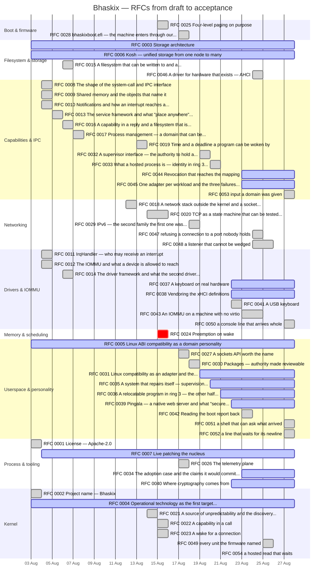

# Bhaskix progress

**Generated by `tools/progress.py` — do not edit.** Run `make progress` after changing `TRACKER.md`; `make gates` fails when this file is stale.

*What that gate proves, exactly:* that this file **matches** what the tracker and the RFC headers currently say — not that anyone regenerated it. A tracker edit that changes only prose leaves this file identical and the gate green, which is correct: nothing here went stale. The gate bites when a count, a date or a status moves.

[`TRACKER.md`](../TRACKER.md) is the source of truth and stays so. This is the view of it: what is finished, what is in flight, and when. **No date here is invented** — an RFC's bar starts the day its file entered the tree and ends the day its own `Status` row says it was accepted. Work with no recorded date is counted below rather than drawn.

## Where the project is

| | |
|---|---|
| RFCs accepted | **37** |
| RFCs open | 16 |
| RFCs closed without shipping | 1 |
| Milestone rows done | **92 of 95** |
| Phase 2 bullets done | **12 of 13** |
| Newest dated entry | 2026-08-28 |

## Timeline

Bars are **real intervals**: file created → accepted. A bar is not an estimate of effort, and an RFC accepted the day it was drafted shows as a single day because that is what happened.

`done` is accepted, `active` is open, `crit` is closed without shipping.

## Milestones

`TRACKER.md`'s milestone rows carry **no dates**, so they are counted rather than charted. Inventing start dates to make a prettier picture is exactly what this file refuses to do.

**M1–M3 have no rows in the tracker** and so are absent from this table. They are not missing work: the detail table starts at M4, and the earlier milestones are summarised in the tracker's own progress cell. Their absence here is a property of the source, said out loud rather than left to read as zero.

| Milestone | Done | Total | |
|---|---:|---:|---|
| M4 | 15 | 18 | ████████░░ |
| M5 | 9 | 9 | ██████████ |
| M6 | 18 | 18 | ██████████ |
| M7 | 15 | 15 | ██████████ |
| M8 | 9 | 9 | ██████████ |
| M9 | 26 | 26 | ██████████ |

## Phase 2 bullets

| Bullet | Status | Recorded date |
|---|---|---|
| Shared memory and notifications | ✅ done | — |
| Service framework | ✅ done | — |
| IOMMU - discovery per-device domains strict mapping | ✅ done | — |
| Driver framework — PCIe/ECAM register_block! Mmio<T> mock-MMIO harness | ✅ done | — |
| Full VFS — mount points writable filesystem journal page cache | ✅ done | — |
| Process management — capability-shaped fork/exec process trees reaping | ✅ done | — |
| Networking — virtio-net Ethernet IPv4/IPv6 UDP TCP sockets | ✅ done | 2026-08-18 |
| Package management and image building | ✅ done | 2026-08-19 |
| Telemetry plane | ✅ done | 2026-08-17 |
| libc — resolved into the Linux personality | ⬜ open | — |
| A fuzz target for the filesystem — a hostile disk image | ✅ done | 2026-08-21 |
| Three fuzz targets that reach nothing from an empty corpus — pkg_manifest pkg_package ustar_parse | ✅ done | 2026-08-21 |
| A coverage-guided fuzz target for IPv6 and NDP | ✅ done | 2026-08-21 |

## Open RFCs

| RFC | Title | Started |
|---|---|---|
| 0003 | Storage architecture | 2026-08-03 |
| 0004 | Operational technology as the first target deployment | 2026-08-03 |
| 0005 | Linux ABI compatibility as a domain personality | 2026-08-03 |
| 0006 | Kosh — unified storage from one node to many | 2026-08-03 |
| 0007 | Live patching the nucleus | 2026-08-04 |
| 0031 | Linux compatibility as an adapter and the containment it must inherit | 2026-08-19 |
| 0034 | The adoption case and the claims it would commit us to | 2026-08-23 |
| 0035 | A system that repairs itself — supervision reconciliation and bounded autonomy | 2026-08-20 |
| 0036 | A relocatable program in ring 3 — the other half of a hosted layout | 2026-08-21 |
| 0037 | A keyboard on real hardware | 2026-08-22 |
| 0038 | Vendoring the xHCI definitions | 2026-08-22 |
| 0039 | Pingala — a native web server and what "secure performant scalable" costs | 2026-08-22 |
| 0040 | Where cryptography comes from | 2026-08-22 |
| 0044 | Revocation that reaches the mapping | 2026-08-23 |
| 0045 | One adapter per workload and the three failures that argued for it | 2026-08-23 |
| 0054 | a hosted read that waits | 2026-08-28 |

## Annexes

Companion documents that share an RFC's number. Counted here rather than as RFCs of their own.

- RFC 0040 — step 1 — the libcrux inspection

